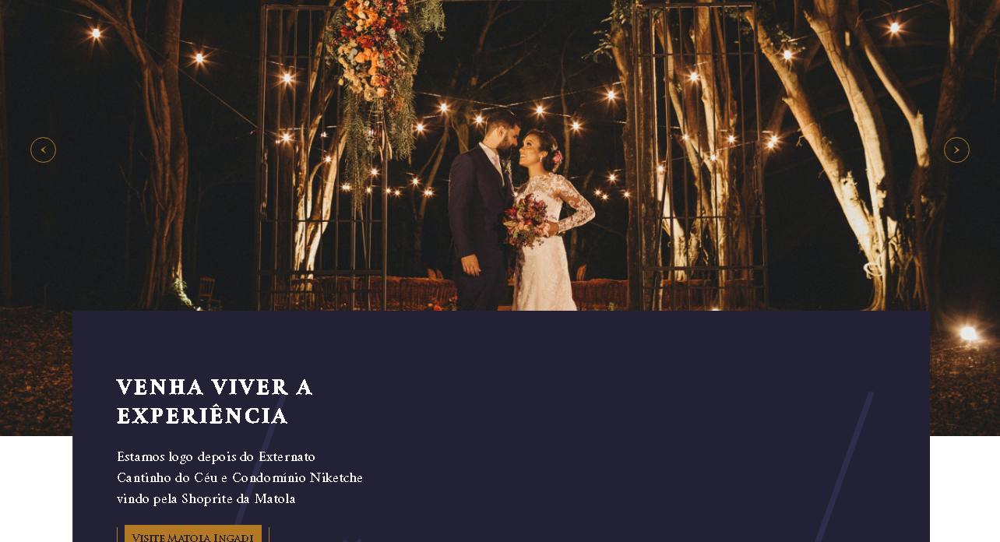

[Matola Ingadi](https://matolaingadi-eight.vercel.app/)

Matola Ingadi is an event hall, so i created a website where they can save events stories, receive an email when a user plans an event in the Lounge, save the user's planned and realized events.
 
For the maintenance of the website I created the superuser which will access the application through a separate client.  
Hi's able to add, edit delete data, so with that the website will always use updated data. (Client [Here](https://github.com/bboa3/Matola-Ingadi/tree/mobile))
